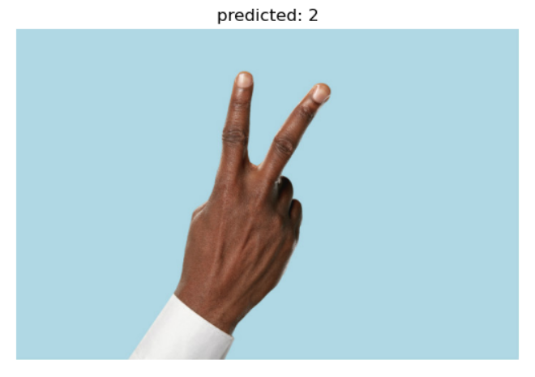

# Hand-Signs using KNN
Predicting Hand Signs 
## Overview

In this project we are prediting hand signs using K Nearest Neighbor. There are different types of Hand Signs, but here we use only hand signs of  Zero, One, Two, Three, Four & Five. But wait.! we are not using any Deep Learning or Neural Networks in this project. Instead we are using KNN a.k.a K-Nearest Neighbor which is one the Machine Learning Algorithms.
## K Nearest Neighbor
KNN algorithm is the laziest algorithm, we can also say KNN as instance based learning. It is called as the laziest algorithm because it does nothing in the training. When we give training data, it just stores the data and does nothing with it. It starts working when we provide testing data. From the figure below red and blue points are the training data and green point is our test data.

## Working
We already know that it does nothing in training data. Now, when we pass the test point (green point from the above figure) it works as the following steps

1. First it finds the distance between the test point and the nearest neighbors to that test point. Now this K is the hyperparameter, that says that how many nearest neighbor should we consider.
2. Suppose assume that K=5, as shown in the figure it considers only 5 nearest points to predict the test point.
3. Then within that 5 points the majority of them have blue points, so this algorithm concludes that the test point (black point) belongs to blue category.
4. Make sure that K value must be an Odd number, if we take even number then we get equal number of points from both categories (here both categories are red and blue).
5. This algorithm uses Euclidian distance to calculate the distance between two points.

In classification problem (discrete value or 1/0) it predicts the majority classes from nearest neighbors.

In regression problem (continuous value) it predicts the average values of the nearest neighbors.

For more information please refer my blog https://mlprojectshub.blogspot.com/2020/07/hand-signs-using-knn.html

## Result:

